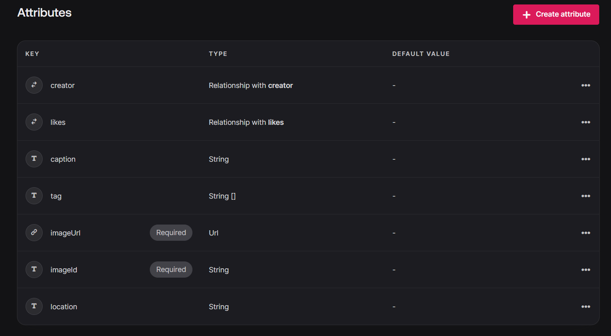
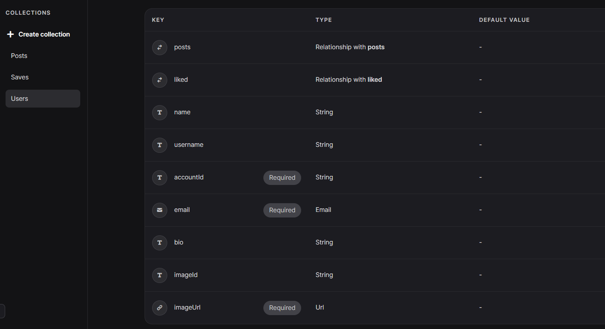
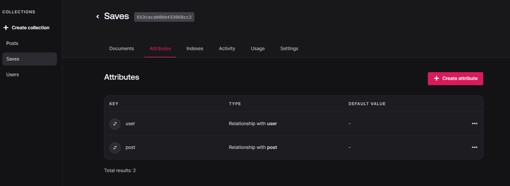

# React + TypeScript + Vite

This template provides a minimal setup to get React working in Vite with HMR and some ESLint rules.

Currently, two official plugins are available:

- [@vitejs/plugin-react](https://github.com/vitejs/vite-plugin-react/blob/main/packages/plugin-react/README.md) uses [Babel](https://babeljs.io/) for Fast Refresh
- [@vitejs/plugin-react-swc](https://github.com/vitejs/vite-plugin-react-swc) uses [SWC](https://swc.rs/) for Fast Refresh

## Expanding the ESLint configuration

If you are developing a production application, we recommend updating the configuration to enable type aware lint rules:

- Configure the top-level `parserOptions` property like this:

```js
   parserOptions: {
    ecmaVersion: 'latest',
    sourceType: 'module',
    project: ['./tsconfig.json', './tsconfig.node.json'],
    tsconfigRootDir: __dirname,
   },
```

- Replace `plugin:@typescript-eslint/recommended` to `plugin:@typescript-eslint/recommended-type-checked` or `plugin:@typescript-eslint/strict-type-checked`
- Optionally add `plugin:@typescript-eslint/stylistic-type-checked`
- Install [eslint-plugin-react](https://github.com/jsx-eslint/eslint-plugin-react) and add `plugin:react/recommended` & `plugin:react/jsx-runtime` to the `extends` list

# le tuto
https://www.youtube.com/watch?v=_W3R2VwRyF4
https://gist.github.com/adrianhajdin/4d2500bf5af601bbd9f4f596298d33ac


# 1. setup project
## installation de tailwind css
1- les commandes sont :
```
npm install -D tailwindcss postcss autoprefixer
npx tailwindcss init -p
npm i tailwindcss-animate
```	
2- configurer le theme dans tailwind.config.js

# 2. routing
## installation de react-router-dom
1- les commandes sont :
```
npm install react-router-dom
```	

# 3. auth pages, form
## shadcn pour créer le formulaire
https://ui.shadcn.com/

1- les commandes sont :
```
npm i -D @types/node
npx shadcn-ui@latest init

```

2- pour intsaller un bouton
```
npx shadcn-ui@latest add button

```	

3- pour l'installation de form
```
npx shadcn-ui@latest add form
```

# 4. api
## installation de appwrite
1- les commandes sont :

```
 npm i appwrite
```

## creation de bucket sur appwrite (storage) 
1- on va dans l'onglet storage, puis creer bucket
2- on donne le nom qu'on, veut. nous va l'appeler "media"
3- on obient un id, puis on le met dans le config de .env.local
VITE_APPWRITE_STORAGE_ID=<l'id du bucket>

## configurer aussi le databases
VITE_APPWRITE_DATABASE_ID=<l'id du databases>


## design la database
### on cree une collection Posts
1- on cree une collection
2- on va dans le settings de la collection
3- dans le roles, on autorise le CRUD

### on cree une collection Users
on fait la meme chose que la collection Posts

### on cree une troisieme collection, "Saves" pour engeristrer les posts 
on fait la meme chose que la collection Posts

### on configure la ralation en les tables
pour le Posts
1. on va dans "attributes" et on met l'id de la collection Posts
2. dans relationship
3. et on choisit le type de la relation qu'on souhaite
4. notre poste ressemble au suivant

5. on cree un index pour faciliter la recherche

pour l'Users, voici le resumé :


pour le Saves, voici le resumé :


### ensuite, on met les ids de chaque colletion dans le config de .env.local
VITE_APPWRITE_SAVES_COLLECTION_ID=<l'id de la collection Saves>
VITE_APPWRITE_POST_COLLECTION_ID=<l'id de la collection Posts>
VITE_APPWRITE_USER_COLLECTION_ID=<l'id de la collection Users>


# react query - tanStack query
https://tanstack.com/table/v8
# installation
```
npm i @tanstack/react-query
```	


# Autres ressources

### loader
https://www.svgbackgrounds.com/elements/animated-svg-preloaders/
